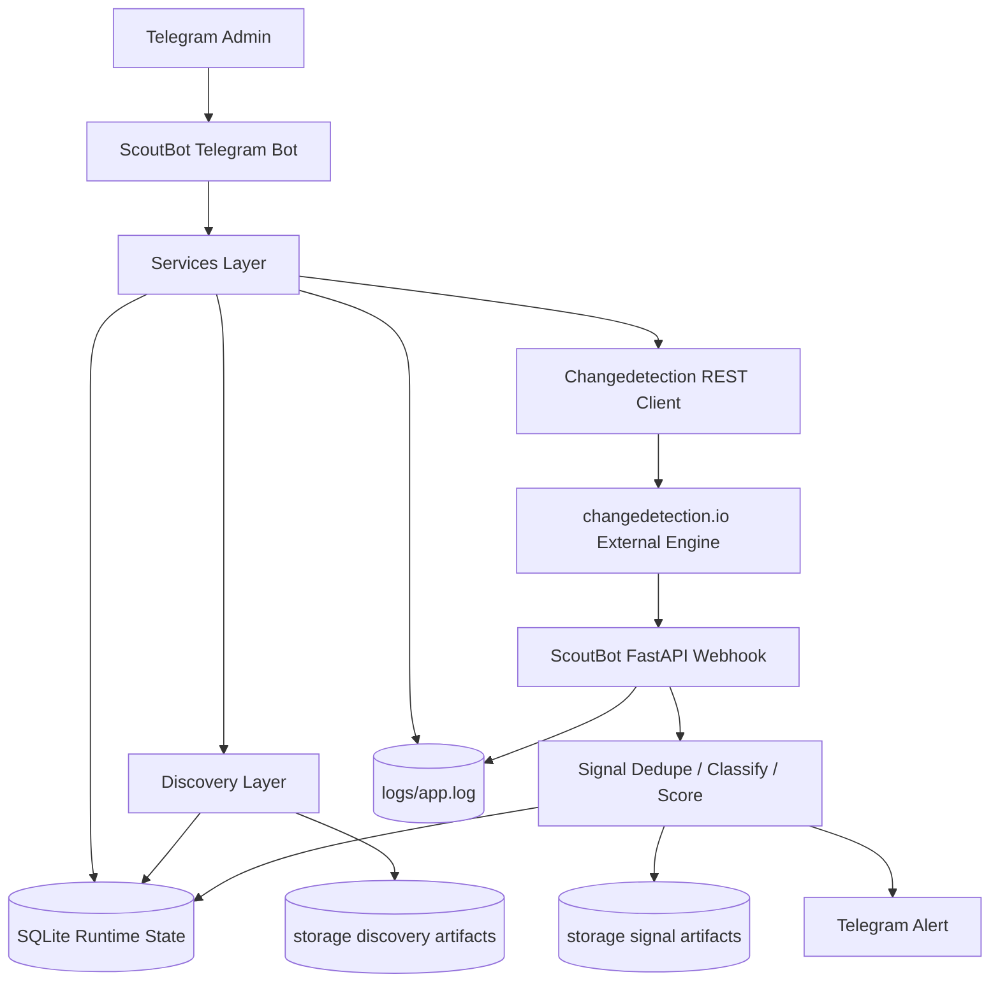

# ARCHITECTURE — ScoutBot

## Назначение

Этот документ описывает архитектуру `ScoutBot`: основные слои, runtime-процессы, source-of-truth правила, границы ответственности и trust boundaries.

`ARCHITECTURE.md` не заменяет:

- `docs/ROADMAP.md` — план этапов и итераций;
- `docs/SPEC.md` — детальные runtime/data contracts;
- `docs/DEV_GUIDE.md` — практический запуск и разработка;
- `docs/SDLC.md` — lightweight development workflow;
- `docs/SECURITY.md` — security rules.

## Идея продукта

`ScoutBot` — Telegram-first self-hosted система мониторинга публичных источников.

Она помогает следить за:

- сайтами конкурентов;
- страницами pricing/services;
- блогами, news, changelog;
- документацией;
- careers;
- RSS/Atom;
- GitHub;
- публичными Telegram-каналами;
- link aggregators;
- публичными social profile pages, если они доступны без обхода auth/ToS.

Основная задача:

```text
оператор добавляет target в Telegram
→ ScoutBot находит связанные официальные источники
→ ставит allowed sources в мониторинг через changedetection.io
→ получает webhook при изменении
→ сохраняет signal
→ отправляет Telegram alert
```

## Главный архитектурный принцип

ScoutBot не пишет собственный crawler/diff-engine.

Правильная схема:

```text
Telegram UI
  → ScoutBot core/services
  → SQLite runtime state
  → changedetection.io REST API
  → changedetection.io fetch/diff engine
  → ScoutBot webhook
  → SQLite signals + artifacts
  → Telegram alerts
```

Где:

- **Telegram UI** — основной operator interface для MVP;
- **ScoutBot core/services** — state management, discovery orchestration, sync, dedupe, classification, notifications;
- **SQLite** — runtime state source of truth;
- **changedetection.io** — внешний engine для fetch/diff/snapshots/notifications;
- **YAML seeds** — import/export/bootstrap, не runtime state;
- **storage artifacts** — evidence для discovery/sync/signals/debug;
- **logs** — runtime diagnostics without secrets.

KISS-правило:

> ScoutBot управляет источниками, состоянием, Telegram UX, sync, signals и artifacts.
> changedetection.io делает низкоуровневый fetch/diff.

## Source of truth

### Runtime/config source of truth

```text
config/settings.yml
```

`config/settings.yml` задаёт:

- active runtime mode;
- logging/storage paths;
- Telegram env key names;
- changedetection API boundary;
- discovery policy;
- signal/dedupe policy;
- optional integrations;
- disabled-by-default AI/n8n blocks.

Обязательные config keys не должны иметь скрытых дефолтов в коде.

Если добавляется новый обязательный config key:

- он должен быть явно описан в `config/settings.yml`;
- он должен валидироваться в `src/scoutbot_module/core/settings.py`;
- при отсутствии или неверном значении приложение должно падать fail-fast с понятной ошибкой.

### Runtime state source of truth

```text
storage/db/scoutbot.sqlite3
```

SQLite хранит:

- workspaces;
- projects;
- targets;
- discovered links;
- changedetection watch UUIDs;
- target states;
- signals;
- audit log;
- Telegram-driven mutations.

Telegram edits должны менять SQLite, не YAML.

### Seed/import/export

```text
config/seeds/*.yml
storage/exports/*.yml
```

YAML seed используется только для:

- bootstrap;
- import;
- export;
- backup;
- examples;
- fixtures.

Неправильно:

```text
Telegram edits → rewrite YAML manually → hope nothing breaks
```

Правильно:

```text
config/seeds/*.yml → import → SQLite → runtime
SQLite → export → storage/exports/*.yml
```

## Runtime entrypoints

Канонический запуск:

```text
./start.sh
  → config/start.py
  → scoutbot_module.core.app
```

`config/start.py` — единственная главная точка запуска.

Он отвечает за:

- project root detection;
- `.env` loading without overriding existing env;
- settings load;
- fail-fast validation;
- directory creation;
- logging setup;
- CLI args parsing;
- runtime/CLI dispatch.

Поддерживаемые MVP entrypoints:

```text
./start.sh
./start.sh doctor
./start.sh init-db
./start.sh import-seed config/seeds/noders.yml
./start.sh export-seed storage/exports/noders.export.yml
./start.sh sync
./start.sh telegram
./start.sh webhook
./start.sh routes
./start.sh digest
./start.sh backup
./start.sh audit [limit]
```

Если `./start.sh` вызван без аргументов, `config/start.py` использует:

```yaml
run:
  mode: "telegram"
```

Явные CLI args имеют приоритет только на текущий запуск и не меняют `config/settings.yml`.

## Runtime processes

MVP состоит из двух ScoutBot-процессов и одного external engine:

```text
./start.sh telegram
./start.sh webhook
changedetection.io
```

### Telegram process

Отвечает за:

- `/start`;
- `/help`;
- `/add`;
- `/projects`;
- `/targets`;
- `/pause`;
- `/resume`;
- `/delete`;
- `/check`;
- inline keyboard UX;
- admin allowlist;
- state-changing actions через services + SQLite;
- Telegram alerts.

### Webhook process

Отвечает за:

- FastAPI webhook receiver;
- changedetection webhook secret validation;
- payload parsing;
- watch/target lookup;
- diff hash calculation;
- dedupe;
- signal creation;
- Telegram alert dispatch.

### changedetection.io

Внешний сервис.

Отвечает за:

- page fetch;
- diff calculation;
- snapshot/change detection;
- notification webhook call.

ScoutBot не импортирует внутренние Python-модули `changedetection.io`.

## Package layout

Ожидаемая структура пакета:

```text
src/scoutbot_module/
  core/
    app.py
    cli.py
    settings.py
    log.py
    paths.py

  db/
    models.py
    session.py
    repo.py
    migrations.py

  changedetection/
    client.py
    payloads.py
    sync.py

  bot/
    app.py
    handlers.py
    keyboards.py
    states.py
    formatters.py
    auth.py

  web/
    app.py
    routes.py
    schemas.py

  discovery/
    fetch.py
    links.py
    feeds.py
    socials.py
    urls.py
    service.py
    kinds.py
    adapters.py

  intelligence/
    classify.py
    dedupe.py
    noise.py
    score.py

  services/
    projects.py
    targets.py
    discovery.py
    signals.py
    notifications.py
```

## Layer responsibilities

### `core/`

Отвечает за базовый runtime:

- settings load;
- fail-fast validation;
- logging;
- project paths;
- app startup;
- CLI dispatch;
- shared runtime helpers.

`core/` не должен содержать business-specific NODERS logic.

### `db/`

Отвечает за SQLite:

- schema;
- models;
- sessions/connections;
- migrations/init;
- repositories;
- deterministic read/write behavior.

SQLite — runtime state source of truth.

### `changedetection/`

Отвечает только за boundary с external engine:

- REST client;
- request/response handling;
- payload builders;
- watch sync;
- changedetection degraded/error state mapping.

Здесь не должно быть Telegram UX, business classification или source graph logic.

### `bot/`

Отвечает за Telegram interface:

- command handlers;
- inline keyboards;
- conversation states;
- formatting;
- admin boundary;
- mapping Telegram actions to service calls.

`bot/` не должен напрямую управлять changedetection API или писать raw SQL, если это можно сделать через services/repositories.

### `web/`

Отвечает за FastAPI webhook receiver:

- route registration;
- webhook secret validation;
- payload schema validation;
- safe request handling;
- dispatch to signal service.

В MVP это не operator dashboard и не web admin.

### `discovery/`

Отвечает за bounded discovery:

- homepage parsing;
- HTML link extraction;
- RSS/Atom discovery;
- sitemap candidate detection;
- social link detection;
- link aggregator parsing;
- degraded status classification.

`discovery/` не должен:

- обходить auth/anti-bot;
- исполнять JavaScript;
- скрапить private social data;
- выполнять unlimited crawling.

### `intelligence/`

Отвечает за deterministic signal quality:

- dedupe;
- category rules;
- priority scoring;
- noise rules;
- mark-as-noise support.

AI не находится в MVP path.

### `services/`

Координационный слой use cases:

- project management;
- target management;
- discovery orchestration;
- sync orchestration;
- signal creation;
- notification flow;
- audit logging.

Services связывают DB, discovery, changedetection, Telegram и artifacts.

## Data model overview

Основные сущности:

```text
Workspace
  └── Project
        └── Target
              ├── TargetLink
              ├── Watch
              └── Signal
```

### Workspace

Логическая область мониторинга.

Пример:

```text
NODERS
```

### Project

Наблюдаемая организация, конкурент, продукт или команда.

### Target

Конкретный URL/source:

- homepage;
- blog;
- docs;
- changelog;
- pricing;
- careers;
- RSS;
- GitHub;
- Telegram public channel;
- social profile;
- link aggregator.

### TargetLink

Связь между исходным target и найденным URL.

### Watch

Связь target с `changedetection.io` watch UUID.

### Signal

Изменение, полученное через webhook и сохранённое в SQLite.

### AuditLog

След state-changing действий оператора.

## Source graph

Каждый target может порождать найденные links.

```text
project
  └── root target
        ├── discovered link: blog
        ├── discovered link: docs
        ├── discovered link: github
        ├── discovered link: telegram
        └── discovered link: x/social profile
```

Модель:

- `target` — то, что мониторится или будет мониториться;
- `target_link` — найденная связь между target и внешней ссылкой;
- `child target` — найденный link, поставленный в очередь мониторинга;
- `watch` — запись в `changedetection.io`;
- `signal` — событие изменения.

Target link может быть:

```text
official
same_domain
social
rss
sitemap
link_aggregator_child
manual
unknown
```

Target link может иметь status:

```text
discovered
queued
active
requires_confirmation
degraded
rejected
```

## Adding a website

Flow:

```text
User sends /add https://competitor.com
  → Telegram admin check
  → validate URL
  → normalize URL
  → create project/target in SQLite
  → write audit log
  → run discovery v0
  → store found links under target
  → auto-queue allowed official links
  → create/update changedetection watches
  → write discovery/sync artifacts
  → reply in Telegram
```

## Adding a social profile / public profile / link aggregator

Target не обязательно должен быть обычным сайтом.

Если пользователь добавляет:

```text
https://x.com/example
https://t.me/example
https://github.com/example
https://linktr.ee/example
https://example.bio/...
```

ScoutBot:

1. сохраняет URL как root target;
2. определяет `source_kind`;
3. пытается извлечь публично доступные links;
4. если находит website, GitHub, YouTube, Telegram, docs, blog — сохраняет под проектом;
5. allowed links ставит в очередь мониторинга;
6. если источник blocked/auth/anti-bot — пишет degraded status.

ScoutBot не должен:

- обходить auth;
- обходить anti-bot;
- скрапить private social data;
- гарантировать стабильность social scraping;
- использовать платные API без отдельного config/roadmap решения.

## changedetection.io boundary

`changedetection.io` — external engine.

ScoutBot использует его через REST API:

- health/check;
- list watches;
- create watch;
- update watch;
- delete watch;
- configure notification URL;
- configure filters/selectors/intervals.

ScoutBot не импортирует внутренние модули `changedetection.io`.

Правильная зависимость:

```text
ScoutBot
  → REST API
changedetection.io
```

Неправильно:

```text
import changedetectionio
```

`changedetection.io` API key читается только из env.

API key не должен попадать в:

- logs;
- storage artifacts;
- webhook artifacts;
- sync artifacts;
- screenshots;
- test snapshots.

## changedetection sync

Sync direction:

```text
SQLite targets → changedetection watches
```

Sync должен:

- читать active/queued targets из SQLite;
- создавать missing watches;
- обновлять existing watches при изменении target config;
- pause/delete watches при изменении target state;
- сохранять changedetection UUID в SQLite;
- избегать duplicate watches;
- писать sync result artifact;
- явно показывать degraded state, если external engine недоступен.

Sync artifacts:

```text
storage/interfaces/changedetection_status.json
storage/interfaces/sync_result.json
storage/runs/<run_id>/target_sync.json
```

## Webhook boundary

Webhook receiver принимает external payload от `changedetection.io`.

Требования:

- webhook secret обязателен;
- missing/invalid secret → reject;
- payload size bounded;
- malformed payload handled gracefully;
- target/watch mapping validated;
- duplicate diff does not spam Telegram;
- raw headers/secrets are not logged;
- raw unbounded HTML diff is not stored.

Webhook flow:

```text
changedetection.io webhook
  → FastAPI route
  → validate secret
  → parse payload
  → lookup watch/target
  → compute diff_hash
  → dedupe
  → classify
  → save signal
  → append signal artifact
  → send Telegram alert
```

## Discovery boundary

Discovery parses untrusted public pages.

Rules:

- allow only HTTP/HTTPS URLs;
- normalize URLs;
- reject private/internal network URLs by default for direct ScoutBot fetches;
- cap response size;
- cap number of discovered links;
- cap discovery depth;
- normalize and deduplicate links;
- store degraded reason;
- do not execute JavaScript;
- do not bypass auth/anti-bot;
- do not scrape private social data.

Discovery artifacts:

```text
storage/discovery/<run_id>/discovered_links.json
storage/discovery/<run_id>/source_graph.json
storage/discovery/<run_id>/degraded_sources.json
```

## Signal path

Signal path is deterministic in MVP.

```text
changedetection webhook
  → target/watch lookup
  → diff_hash
  → dedupe
  → category rules
  → priority score
  → SQLite signal
  → storage/signals/<YYYY-MM-DD>.jsonl
  → Telegram alert
```

Duplicate rule:

```text
same target_id + same diff_hash = duplicate
```

Duplicate signals must not spam Telegram.

AI is not part of MVP signal source of truth.

## Artifact model

Artifacts are evidence, not runtime state source of truth.

Typical artifacts:

```text
logs/app.log
storage/db/scoutbot.sqlite3
storage/runs/<run_id>/target_sync.json
storage/runs/<run_id>/webhook_event.json
storage/discovery/<run_id>/discovered_links.json
storage/discovery/<run_id>/source_graph.json
storage/discovery/<run_id>/degraded_sources.json
storage/signals/<YYYY-MM-DD>.jsonl
storage/interfaces/changedetection_status.json
storage/interfaces/sync_result.json
storage/exports/<name>.export.yml
```

Artifacts must be:

- reproducible;
- bounded;
- useful for debugging;
- aligned with logs;
- free from secrets.

Artifacts must not become a second runtime source of truth.

## Logging model

Main log:

```text
logs/app.log
```

Logs should be:

- in English;
- useful for diagnostics;
- concise enough for operator inspection;
- free from secrets.

Allowed logs:

- high-level runtime events;
- reason codes;
- target IDs;
- watch UUIDs if non-secret;
- artifact paths;
- non-sensitive config choices.

Not allowed:

- Telegram token;
- changedetection API key;
- webhook secret;
- raw auth headers;
- full `.env`;
- full unredacted settings dump;
- unbounded external payload dumps.

## Security and trust boundaries

Main trust boundaries:

```text
Telegram user input
CLI args
config/settings.yml
seed YAML
URLs
HTML/RSS/sitemap payloads
changedetection API responses
changedetection webhooks
restored JSON artifacts
filesystem paths
```

Security-sensitive areas:

- env/secrets handling;
- URL validation;
- HTML/RSS parsing;
- webhook validation;
- changedetection API boundary;
- Telegram admin boundary;
- SQLite writes;
- file/path handling;
- dependency changes.

Core rules:

- secrets only from env;
- admin-only state mutations in Telegram;
- fail-fast settings validation;
- no hidden sensitive defaults;
- no arbitrary user-provided code execution;
- no arbitrary jq/filter authority for normal Telegram users;
- changedetection kept private by default;
- no paid APIs without explicit decision.

## Telegram admin boundary

State-changing Telegram commands must check admin allowlist.

State-changing commands:

```text
/add
/pause
/resume
/delete
/check
```

`/check` is state-changing if it triggers sync/discovery/fetch.

Admin source:

```text
TELEGRAM_ADMIN_IDS
```

Telegram token source:

```text
TELEGRAM_BOT_TOKEN
```

Alert chat source:

```text
TELEGRAM_ALERT_CHAT_ID
```

State-changing actions should write audit log.

## What does not live in ScoutBot

ScoutBot must not:

- write its own full crawler;
- write its own full diff-engine;
- bypass anti-bot/auth;
- parse private social data;
- use paid APIs without explicit decision;
- require AI for MVP;
- store runtime state in YAML;
- keep NODERS-specific business logic in core;
- use n8n as core state/runtime layer;
- expose changedetection publicly by default;
- allow arbitrary jq/xpath/css editing from Telegram in MVP.

## AI boundary

AI is disabled in MVP.

Allowed later:

- optional summaries;
- optional daily digest;
- optional relevance scoring after deterministic filters.

Not allowed:

- AI as source of truth for whether a page changed;
- AI-triggered external actions;
- AI-required MVP path;
- AI bypassing Telegram admin boundary;
- AI mutating targets without deterministic validation.

AI, if added later, must be bounded and assistive only.

## n8n boundary

n8n is not part of core MVP.

Allowed later:

```text
changedetection.io → n8n webhook → Telegram/Slack/CRM
```

Not allowed in MVP:

- storing target state in n8n;
- Telegram management via n8n workflows;
- source graph in n8n;
- business logic in n8n;
- replacing SQLite as runtime state source of truth.

If n8n appears later, it must be optional router/integration, not ScoutBot core.

## Docker and deployment strategy

MVP dev strategy:

- `changedetection.io` through Docker/Compose;
- ScoutBot locally through `./start.sh`;
- SQLite in local `storage/db/`;
- `.env` for secrets.

Recommended changedetection binding:

```yaml
ports:
  - "127.0.0.1:5000:5000"
```

ScoutBot Dockerfile can be added later, but it should not block MVP.

Production later may use:

```text
scoutbot-telegram
scoutbot-webhook
changedetection
sqlite volume
reverse proxy optional
```

Default secure deployment:

- `changedetection.io` bound to `127.0.0.1` or internal Docker network;
- `CHANGEDETECTION_API_KEY` from env;
- Telegram bot token from env;
- webhook secret from env;
- no public web UI in MVP.

## Mermaid diagram



## Data flow summary

### Add target flow

```text
Telegram /add
  → admin check
  → URL validation
  → SQLite target
  → audit log
  → discovery run
  → target links
  → child targets
  → changedetection sync
  → Telegram response
```

### Sync flow

```text
SQLite active/queued targets
  → changedetection payload builder
  → changedetection REST API
  → watch UUIDs
  → SQLite watches
  → sync artifacts
```

### Change alert flow

```text
changedetection detects change
  → webhook
  → secret validation
  → target/watch lookup
  → diff hash
  → dedupe
  → classify/priority
  → SQLite signal
  → signal artifact
  → Telegram alert
```

## Development architecture rule

ScoutBot currently follows direct-main SDLC-light:

```text
ROADMAP iteration → code → tests → artifacts/logs → commit → main
```

Issue, branch and PR are optional later process upgrades, not required for the current local workflow.

Architecturally important rule:

> Even without PR/branch ceremony, every change must still be scoped to the current ROADMAP iteration, tested through the expected entrypoint, and verified through logs/artifacts where applicable.

## Future expansion boundaries

Allowed future extensions:

- stronger signal quality;
- RSS/GitHub/public Telegram adapters;
- optional n8n router;
- export/import/backup;
- read-only dashboard later;
- optional AI summaries after deterministic signal path is stable.

Risky extensions that require explicit roadmap decision:

- custom crawler;
- Playwright/browser automation inside ScoutBot;
- paid social APIs;
- private social scraping;
- multi-user SaaS;
- public admin UI;
- AI-triggered external actions;
- arbitrary filter editing from Telegram.

## Summary

ScoutBot architecture is intentionally simple:

```text
Telegram + SQLite + changedetection.io + FastAPI webhook + storage artifacts
```

Core rules:

- `config/settings.yml` is runtime/config source of truth;
- SQLite is runtime state source of truth;
- YAML is seed/import/export only;
- changedetection.io is the external fetch/diff engine;
- ScoutBot owns Telegram UX, state, discovery, dedupe, alerts and artifacts;
- no AI in MVP;
- no n8n as core;
- no YAML runtime state;
- no crawler/diff-engine inside ScoutBot while changedetection.io covers the job.
